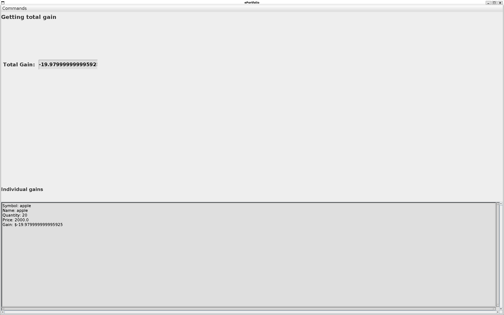

# E-Portfolio Project

## Introduction

This document outlines the implementation of the **E-Portfolio Project** for Assignment Three. In this version, a **GUI
interface** is built using **Java Swing**, and exception handling is added to make the application robust and
user-friendly. The application allows users to manage their investments through various interactive interfaces,
including **Buy**, **Sell**, **Update**, **Get Gain**, and **Search** commands.

---

## Table of Contents

1. [Problem Statement](#problem-statement)
2. [Assumptions and Limitations](#assumptions-and-limitations)
3. [User Guide](#user-guide)
    - 3.1 [Building the Program](#building-the-program)
    - 3.2 [Using the GUI](#using-the-gui)
    - 3.3 [Adding GUI Screenshots](#adding-gui-screenshots)
4. [Test Plan](#test-plan)
    - 4.1 [Test Cases](#test-cases)
    - 4.2 [Fail Cases](#fail-cases)
5. [Exception Handling](#exception-handling)
6. [Possible Improvements](#possible-improvements)
7. [Owner](#owner)

---

## Problem Statement

The goal of this project is to create a robust e-portfolio application that allows users to manage investments through a
graphical interface. The application should handle user errors gracefully with appropriate error messages and include
modularity, abstraction, and polymorphism in its design.

---

## Assumptions and Limitations

### Assumptions:

- Users are familiar with basic GUI applications.
- Investment details (symbols, names, prices) provided by users are valid inputs.

### Limitations:

- Only supports **Stock** and **Mutual Fund** investments.
- Multimedia or real-time collaboration is not supported.

---

## User Guide

### 3.1 Building the Program

1. **Navigate to the Project Directory**:  
   Ensure you are in the directory containing the project files.

   ```cd path/to/<dkumar07_a3>```

2. **Compile the Program**:  
   ```javac src/*.java```

3. **Run the Application**:  
   ```java src/Portfolio.java```

<hr></hr>

### 3.2 Using the GUI

#### The application provides the following interfaces, each corresponding to a menu option:

1. **Welcome Interface**:  
   Displays a welcome message and instructions.  
   Accessible via the "Commands" menu.
2. **Buy Interface**:  
   Allows users to add new investments or update existing ones.  
   Features input fields for type, symbol, name, quantity, and price.  
   Includes Reset and Buy buttons.
3. **Sell Interface**:  
   Enables users to sell part or all of their investments.  
   Features input fields for symbol, quantity, and price.
4. **Update Prices Interface**:  
   Lets users update the price of investments.  
   Includes Prev, Next, and Save buttons for navigation and editing.
5. **Get Gain Interface**:  
   Displays the total gain and individual investment gains.  
   Includes a non-editable text field for the total gain.
6. **Search Investments Interface**:  
   Allows users to search for investments using partial or full symbol, name, or price ranges.
7. **Quit Interface**:  
   Exits the application.

<hr></hr>

## The interface features:

### 3.3 GUI Screenshots

To document the GUI, add screenshots for each interface in this section. For example:

#### Welcome Screen


#### Buy Investment Screen


#### Sell Investment Screen


#### Update Prices Screen


#### Get Gain Screen



#### Search Investments Screen

 <hr></hr>

# Test Plan

<hr></hr>

### 4.1 Test Cases

#### Buy Investments:

- **Valid inputs**: Add investments with valid symbols, names, prices, and quantities.
- **Check**: Verify if investments are added correctly.

#### Sell Investments:

- **Valid inputs**: Sell partial or full quantities of investments.
- **Check**: Verify updates to quantity and gains.

#### Update Prices:

- **Navigation**: Test navigation using Prev and Next buttons.
- **Check**: Verify if prices are updated correctly.

#### Search Investments:

- **Test**: Enter valid and invalid search terms.

<hr></hr>

### 4.2 Fail Cases

- **Invalid symbol or name**: When creating or searching investments.
- **Same Investment**: Cannot add another investment with the same symbol(Mutual Fund/Stock).
- **Negative or zero quantities**: For buying or selling.
- **Invalid price ranges**: For search or updates.

---

## Exception Handling

### Key Areas

#### Invalid Input:

- **Non-numeric values**: Trigger error messages in numeric fields.
- **Empty or invalid fields**: Prompt user re-entry.

#### Invariant Violations:

- **Invalid quantities, prices, or symbols**: Throw exceptions.

---

## Possible Improvements

- **Export Feature**: Export portfolio data to a PDF or CSV file.
- **Real-Time Collaboration**: Add multi-user functionality.
- **Data Visualization**: Include charts to represent portfolio performance.

## Owner

- **Name**: [Daman Kumar]
- **ID**: [1306900]